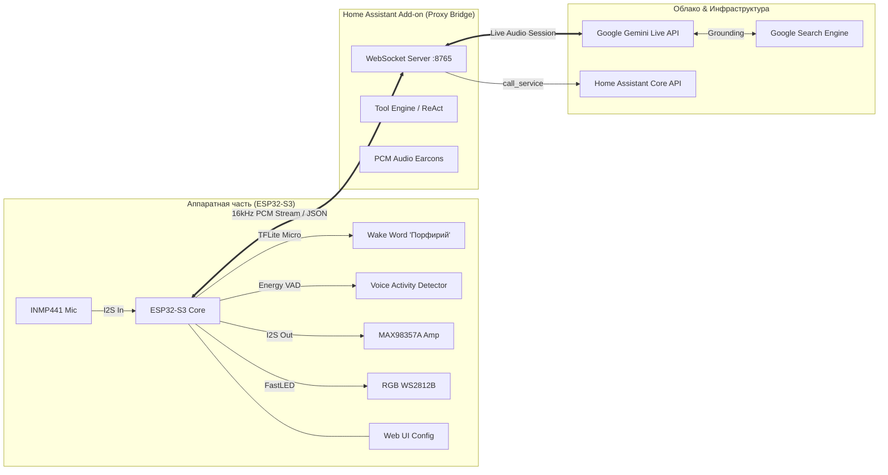

# 🎙️ Porfiriy Voice Assistant (Порфирий)

[](https://www.home-assistant.io/)
[](https://www.espressif.com/)
[](https://platformio.org/)
[](https://ai.google.dev/)
[]()

**Порфирий** — высокоскоростной двунаправленный голосовой ассистент нового поколения для **Home Assistant**, использующий **Google Gemini Live Audio API** и автономную микрофонную колонку на базе **ESP32-S3**.

В отличие от классических конвейеров (STT ➡️ LLM ➡️ TTS), Порфирий работает с **прямым двунаправленным аудиопотоком 16 kHz**: голос пользователя передаётся сразу в нейросеть Gemini, а синтезированный ответ воспроизводится в реальном времени с задержкой менее секунды.

---

## ✨ Ключевые возможности

* ⚡ **Субсекундный отклик (Gemini Live Audio)**: Потоковая передача 16-битного PCM звука без промежуточных конвертаций речи в текст.
* 🧠 **Локальный Wake Word («Порфирий»)**: Нейросетевой детектор на базе **TensorFlow Lite Micro** и `esp-micro-speech-features` исполняется непосредственно на чипе ESP32-S3. Никаких платных облачных сервисов для активации.
* ⏪ **Буфер предзаписи (Pre-roll buffer 1 сек)**: Плата непрерывно хранит последнюю секунду звука. При срабатывании вейкворда буфер отправляется на сервер, что позволяет произносить команду слитно («Порфирий включи свет») без паузы.
* 🛡️ **Надёжный конечный автомат (State Machine v0.0.39)**:
  * Полное разделение фаз: `IDLE` (ожидание) ➡️ `LISTENING` (запись) ➡️ `THINKING` (генерация) ➡️ `SPEAKING` (ответ).
  * Автоматическое отключение детектора вейкворда во время размышлений и речи — колонка никогда не триггерит саму себя звуком из динамика.
  * Сторожевые таймеры (Watchdog) исключают зависания при сетевых сбоях.
* 🤫 **Локальный Energy VAD**: Аппаратный детектор пауз в речи на ESP32. Как только вы замолчали (~700 мс тишины), плата сразу переходит в режим ожидания ответа, не заставляя ждать таймаутов.
* 🏠 **Управление умным домом**: Интеграция с Home Assistant через Tool Calling (ReAct) — управление любыми выключателями, светом, климатом и скриптами.
* 🌐 **Google Search Grounding**: Поиск актуальной информации в интернете через встроенный инструмент поиска Google.
* 🔔 **Звуковые уведомления (Earcons)**: Генерация чистых синусоидальных звуков подтверждения («Дзинь») и ошибок («Бум») прямо из бэкенда.
* ⚙️ **Встроенный Web-интерфейс на ESP32**:
  * Кастомные режимы индикатора (Выключен / Статичный / Дыхание) и RGB-палитра отдельно для каждого из 4 статусов.
  * Калибровка чувствительности микрофона, громкости динамика, порога вейкворда и таймаутов VAD.
  * Сохранение настроек в энергонезависимую память (NVS) «на лету» без перезагрузки платы.
  * Первичная настройка через Wi-Fi точку доступа `Porfiriy_Setup` (Captive Portal).

---

## 🏛️ Архитектура системы



---

## 🔌 Подключение оборудования (Hardware Pinout)

Для сборки голосовой колонки используются доступные модули:
* **ESP32-S3 DevKitC-1** (рекомендуется с 8MB/16MB Flash и 8MB PSRAM)
* **INMP441** — I2S цифровой микрофон
* **MAX98357A** — I2S цифровой аудиоусилитель (3W)
* **Динамик** — 4–8 Ом, 3–5 Вт
* **WS2812B** — Адресный RGB-светодиод (или встроенный на пине 48/21)

| Модуль | Пин модуля | Пин ESP32-S3 | Описание |
| :--- | :--- | :--- | :--- |
| **INMP441** (Микрофон) | SCK / BCLK | **GPIO 3** | Тактирование I2S микрофона |
| | WS / LRCLK | **GPIO 8** | Выбор канала |
| | SD / DIN | **GPIO 10** | Аудиоданные с микрофона |
| | L/R | GND | Левый канал |
| | VDD / GND | 3.3V / GND | Питание 3.3V |
| **MAX98357A** (Усилитель) | BCLK | **GPIO 4** | Тактирование I2S динамика |
| | LRC / LRCLK | **GPIO 5** | Выбор канала |
| | DIN / DOUT | **GPIO 6** | Аудиоданные на динамик |
| | GAIN | GND / Open | Коэффициент усиления (9–12 дБ) |
| | VIN / GND | 5V / GND | Питание (рекомендуется 5V) |
| **WS2812B** (LED) | DIN / DI | **GPIO 48** *(или 21)* | Адресная линия FastLED |

---

## 🚀 Установка и настройка

### Шаг 1. Установка аддона в Home Assistant

1. В Home Assistant перейдите в **Настройки ➡️ Дополнения ➡️ Магазин дополнений**.
2. В верхнем правом меню выберите **Репозитории** и добавьте URL вашего репозитория:
   ```text
   https://github.com/d3890666/Porfiriy-Voice-Assistant
   ```
3. Найдите в списке дополнение **«Porfiriy Voice Assistant»** и нажмите **Установить**.
4. Во вкладке **Конфигурация** укажите:
   * `gemini_api_key`: ваш API-ключ от [Google AI Studio](https://aistudio.google.com/).
   * `gemini_model`: модель Gemini (по умолчанию `gemini-2.0-flash-exp`).
   * `system_prompt`: системная персона ассистента (по умолчанию настроена персона Порфирия с циничным стилем и лаконичным подтверждением команд).
5. Запустите аддон и включите **Запуск при загрузке системы**.

---

### Шаг 2. Прошивка ESP32-S3

Проект прошивки находится в папке `esp32_firmware` и компилируется через **PlatformIO**:

1. Откройте папку `esp32_firmware` в VS Code с установленным расширением PlatformIO (или используйте PlatformIO CLI).
2. Подключите плату ESP32-S3 по USB.
3. Выполните сборку и прошивку:
   ```bash
   cd esp32_firmware
   pio run -t upload
   ```
4. Для просмотра отладочного вывода откройте монитор порта:
   ```bash
   pio device monitor
   ```

---

### Шаг 3. Первоначальное подключение к Wi-Fi

1. При первом включении плата создаст открытую Wi-Fi сеть: **`Porfiriy_Setup`**.
2. Подключитесь к этой сети со смартфона или ноутбука (откроется окно Captive Portal).
3. Введите:
   * Имя домашней сети Wi-Fi (SSID) и пароль.
   * IP-адрес сервера Home Assistant (где запущен аддон) и порт (по умолчанию `8765`).
4. Нажмите **Save and Connect**. Плата перезагрузится и подключится к домашней сети.

---

### Шаг 4. Управление и веб-интерфейс

После подключения откройте браузер по IP-адресу платы (например, `http://192.168.1.150`):

* 🎚️ **Настройки звука**: усиление микрофона, громкость динамика и чувствительность детектора слов.
* ⏱️ **Таймауты VAD**: порог тишины (по умолчанию `700 ms`) и максимальное время прослушивания.
* 🌈 **Настройки индикатора (FastLED)**:
  * Индивидуальный выбор эффекта для каждого состояния:
    * **IDLE** (Ожидание вейкворда): *Выключен / Статичный / Дыхание*
    * **LISTENING** (Слушает фразу): *Выключен / Статичный / Дыхание*
    * **THINKING** (Обработка нейросетью): *Выключен / Статичный / Дыхание*
    * **SPEAKING** (Ответ колонки): *Выключен / Статичный / Дыхание*
  * Индивидуальный выбор цвета через RGB Color Picker.
* Все изменения сохраняются мгновенно без перезагрузки платы (через AJAX в NVS-память).

---

## 🛠️ Отладка на ПК (Debug Client)

В директории `client/` доступен скрипт `debug_client.py` для тестирования логики без физической платы:
```bash
pip install sounddevice websockets
python client/debug_client.py
```
Клиент позволяет говорить в микрофон ПК, слышать ответы и вводить текстовые команды прямо в консоли.

---

## 📝 Список изменений (Changelog)

### Версия 0.0.51 (Темпирование воспроизведения фраз и защита от сброса)
* ⏱️ **Paced Audio Playback**: Корректная отправка PCM-чанков на ESP32 с реальным темпом (~38мс на чанк) и пробуждением динамика через  перед началом реплики, исключая отсечение звука и переполнение буфера.
* ⚡ **Live Watchdog Interrupt**: Прерывание фразы ожидания (), как только Gemini начинает возвращать ответ.

### Версия 0.0.50 (Замена Part.from_text на types.Part)
* 🩹 **Direct types.Part(text=...)**: Замена методов `Part.from_text` на надежный прямой конструктор `types.Part(text=...)` для системы озвучки.

### Версия 0.0.49 (Исправление LiveConnectConfig для WebSocket-синтеза)
* 🩹 **LiveConnectConfig Fix**: Исправлен `response_modalities=["AUDIO"]` и `Part.from_text(text=...)` для синтеза фраз через `client.aio.live.connect`.

### Версия 0.0.48 (Синтез системных реплик через Live WebSocket)
* 🎙️ **Live WebSocket Audio Synthesis**: Озвучка системных реплик переведена на нативную сессию Gemini Live WebSocket (`bidiGenerateContent`). Все 12 реплик синтезируются в рамках одной сессии напрямую в 24 кГц PCM голосом `Charon` без ограничений HTTP REST.

### Версия 0.0.47 (Таймаут размышлений 7 секунд)
* ⏱️ **7s Thinking Timeout**: Таймаут ожидания перед воспроизведением фразы-заполнителя увеличен до 7 секунд (настраивается через параметр `thinking_timeout_s`).

### Версия 0.0.46 (Фикс модели генерации реплик и бамп версии)
* 🩹 **Direct User Model Resolution**: Устранена подстановка устаревшей `gemini-2.0-flash-exp`, генератор фраз использует ровно ту модель, которая задана в `gemini_model`.

### Версия 0.0.45 (Динамический генератор системных реплик Порфирия)
* 🧠 **Dynamic Persona-Driven Audio Cache**: Вместо статичных констант Порфирий теперь **сам придумывает и озвучивает** свои технические реплики на основе живого поля `prompt_persona`.
  * **Двухшаговый пайплайн**: Gemini в роли Порфирия генерирует структурированный JSON коротких (1–4 слова) язвительных и глубоких фраз без шаблонных роботических клише. Затем каждая фраза синтезируется через Gemini Audio TTS голосом `Charon` и кэшируется на диск в `/data/audio_cache/`.
  * **Категории событий**:
    * `thinking`: Заполнители паузы, если сложный поиск (музыка, база знаний) занимает больше 2.5 секунд (например: *«Минуту, созерцаю бездну»*, *«Сверяю смыслы»*).
    * `network_error`: Вместо тишины при обрыве сети или ошибке 1011 (например: *«Облака опять ослепли»*, *«Магистраль легла»*).
    * `device_error`: При сбое оборудования умного дома в Home Assistant (например: *«Железка взбрыкнула»*, *«Реле в ауте»*).
    * `empty_noise`: При ложном срабатывании вейкворда на шум или тишине (например: *«Шум слышу, мысли — нет»*).
* 🔄 **Автоматическая инвалидация по изменению роли**: Если пользователь меняет `prompt_persona` или голос в интерфейсе Home Assistant, хэш роли обновляется, и Порфирий автоматически генерирует свежие фразы в обновленном стиле. Также добавлен тумблер `regenerate_phrases` в настройках аддона для принудительного обновления.
* ⚡ **Zero-Latency Playback**: Предсгенерированные PCM-файлы отдаются мгновенно (0 мс), не задерживая основной ответ от Gemini Live.

### Версия 0.0.44 (Управление шторами/жалюзи, распознавание Денис/Света и 4 модульных промпта)
* 🪟 **Cover Domain & Curtains Control**: Добавлена полноценная поддержка домена `cover` (шторы, жалюзи, рулонные шторы) в `backend/ha_api.py`. Обновлена схема инструмента `call_ha_service` в `backend/gemini_client.py` (`open_cover`, `close_cover`, `stop_cover`, `set_cover_position`). В `backend/main.py` реализована передача расширенных параметров (`position: 0-100`, `temperature`, `hvac_mode`), благодаря чему Порфирий теперь открывает/закрывает шторы как полностью, так и на заданный процент.
* 👥 **Acoustic Speaker Recognition (Денис / Света)**: Поскольку Gemini Live напрямую получает PCM аудиопоток 16 кГц, модель способна в реальном времени анализировать высоту основного тона (F0) и тембр голоса:
  * Низкий голос (~85–180 Гц): идентификация Дениса (мужской род глаголов в русском языке: «понял», «сделал», «ты спросил»).
  * Высокий голос (~165–260+ Гц): идентификация Светы (женский род глаголов: «поняла», «сделала», «ты спросила»).
* 🧩 **Модульный системный промпт (4 поля конфигурации)**: Монолитный промпт разделен на 4 независимых англоязычных модуля в `config.yaml`:
  * `prompt_persona`: Идентичность Порфирия (алгоритмический следователь 10-го поколения из романа «iPhuck 10» В. Пелевина), лексический диссонанс, «Uber»-техника и ироничный цинизм.
  * `prompt_users`: Профили пользователей Дениса и Светы, акустические частоты и динамическое согласование родов в русском языке.
  * `prompt_smart_home`: Правила управления устройствами (включая шторы `cover`), приоритет устройств и строгое правило подтверждения ровно в 1 слово («Исполнено.», «Зафиксировано.», «Штатно.»).
  * `prompt_general`: Общий диалог, поиск информации через Google Search, воспроизведение музыки через Music Assistant, лаконичность (1-2 предложения) и мгновенный стоп-режим («Умолкаю.»).
* 🌐 **Локализация интерфейса аддона**: Добавлены файлы `translations/ru.yaml` и `translations/en.yaml` с понятными названиями и подсказками для всех полей в веб-интерфейсе Home Assistant.

### Версия 0.0.43 (Media Ducking и голосовое прерывание Barge-In)
* 🔇 **Automated Media Ducking**: При обнаружении вейкворда бэкенд автоматически находит все играющие медиаплееры в Home Assistant (Music Assistant, Яндекс Станции, ресиверы) и плавно приглушает их громкость до 25%. После завершения ответа или таймаута исходная громкость восстанавливается.
* 🛑 **Wake Word Barge-In**: В прошивку ESP32 добавлена возможность перебивать говорящего ассистента словом «Порфирий». В Web UI добавлен переключатель «Разрешить прерывание речи вейквордом (Barge-in)».
* 🤐 **Anti-Verbosity Directive**: В системный промпт добавлены директивы лаконичности в диалоге (1–2 емких предложения) и немедленного замалчивания по командам «хватит», «стоп», «молчи».

### Версия 0.0.42 (Исправление совместимости с websockets v13+)
* 🐛 **Fix ServerConnection State**: Замена websocket.closed на while True во избежание AttributeError в библиотеке websockets, из-за которого корутина чтения Gemini падала сразу при подключении клиента.

### Версия 0.0.41 (Полноценный Multi-turn в сессиях Gemini Live)
* 🔄 **Persistent Multi-Turn Listener**: Устранена критическая проблема, из-за которой генератор `session.receive()` завершал корутину после первого хода. Добавлен непрерывный цикл `while not websocket.closed:`, позволяющий ассистенту стабильно работать на 2-м, 3-м, 4-м и последующих вызовах без обрыва сессии.
* 🎙️ **Session State Reset**: Гарантированный сброс флагов аудиопотока при каждом новом срабатывании вейкворда.

### Версия 0.0.40 (Стабилизация серверного VAD)
* 🎚️ **Adaptive Silence Padding**: Динамический расчет и отправка расширенного буфера тишины (≥896 мс / с запасом к vad_silence_duration_ms) при наступлении события end_of_speech от ESP32. Гарантирует надежное и быстрое закрытие хода Gemini Live даже на коротких фразах.

### Версия 0.0.39 (Ключевое обновление архитектуры)
* 🔄 **State Machine Architecture**: Полноценный конечный автомат на ESP32 (`IDLE`, `LISTENING`, `THINKING`, `SPEAKING`), устраняющий рассинхронизацию состояний с сервером.
* 🔇 **Acoustic Echo & Loop Protection**: Полное отключение детектора вейкворда во время фаз размышления и воспроизведения речи — колонка больше не реагирует на собственный динамик.
* 🎯 **Local Energy VAD**: Интеллектуальное отслеживание тишины на микрофоне. Зависание синего диода после окончания фразы полностью устранено.
* 💡 **Individual LED Profiles**: В Web UI добавлены раздельные настройки анимации (Выключен, Горит, Дышит) и палитра цветов для каждого из четырёх состояний.
* 🩹 **Gemini Live 1008 Policy Fix**: Исправлен сбой протокола Gemini Live WebSocket — переход хода теперь формируется корректным PCM silence padding вместо пустых текстовых партов.
* ⏱️ **Watchdog Timers**: Добавлены таймауты против «вечного думания» и зависания аудиопотоков.

---

## 👤 Автор и лицензия

* **Разработчик:** Нефедов Денис Сергеевич ([@d3890666](https://github.com/d3890666))
* **Email:** dnefedov@dkss.ru
* **Лицензия:** MIT
